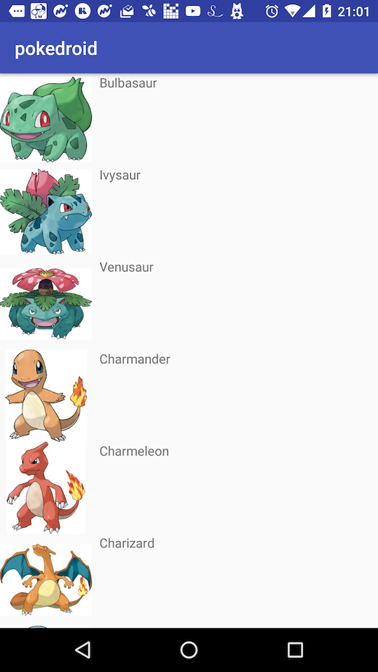

# Pokedroid
Pokemon app for Android (using graphql-pokemon)

## Libraries
- [Paging](https://developer.android.com/topic/libraries/architecture/paging.html#overview)
- [LiveData](https://developer.android.com/topic/libraries/architecture/livedata.html)
- [ViewModel](https://developer.android.com/topic/libraries/architecture/viewmodel.html)
- [Constraint Layout](https://developer.android.com/training/constraint-layout/index.html)
- [RxJava & RxAndroid & RxKotlin](https://github.com/ReactiveX/RxAndroid)
- [Glide](https://github.com/bumptech/glide)
- [apollo-android](https://github.com/apollographql/apollo-android/)

